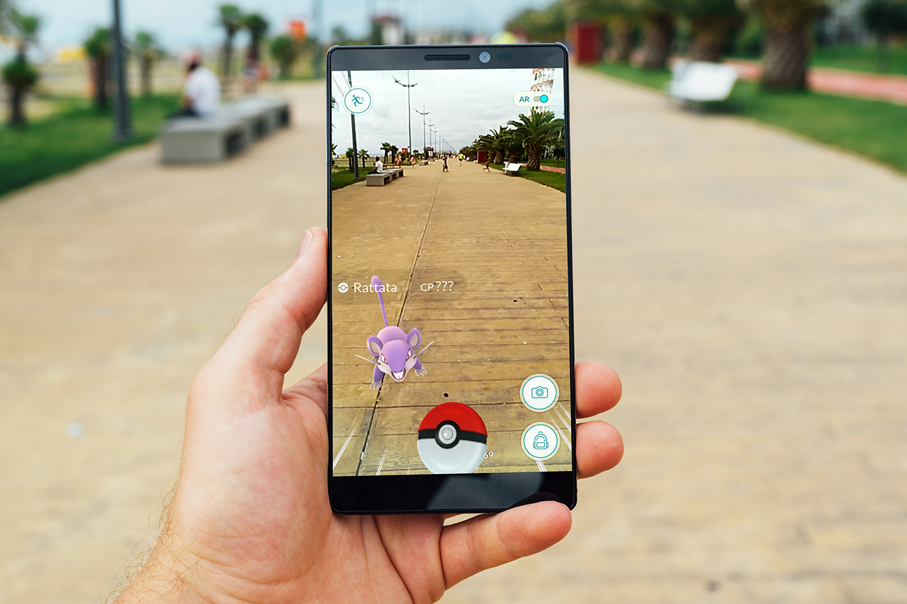
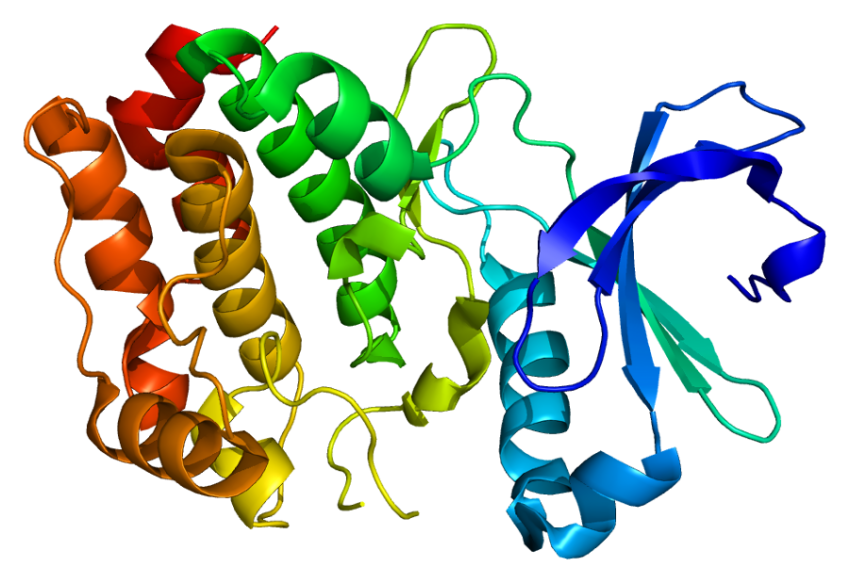

# Project Name

TODO: short project description here
TODO: some sample screenshots or mockups

## Docs
- [project proposal](https://docs.google.com/a/dali.dartmouth.edu/forms/d/e/1FAIpQLSeMBJFHZa7v5BGYa-UknniPbWvKty6IzG4myaNo-CEExCUcfw/viewform?fbzx=-2243464441135256300)
- [feature spec](https://docs.google.com/a/dali.dartmouth.edu/forms/d/e/1FAIpQLSeMBJFHZa7v5BGYa-UknniPbWvKty6IzG4myaNo-CEExCUcfw/viewform?fbzx=-2243464441135256300)
- [designs](https://docs.google.com/a/dali.dartmouth.edu/forms/d/e/1FAIpQLSeMBJFHZa7v5BGYa-UknniPbWvKty6IzG4myaNo-CEExCUcfw/viewform?fbzx=-2243464441135256300)
- anything else!

## Architecture

TODO: descriptions of code organization, tools, and libraries used
  - [google](https://www.google.com/)
  - [github](https://github.com/)

## Setup

TODO: how to get the project dev environment up and running
  - `npm install`, or maybe
  - `pod install`

## Deployment

TODO: how to deploy the project

## Authors

TODO: list of authors with years and current term
- author 1 (designer, PM)

## Acknowledgments

TODO: anyone who helped you along the way!
